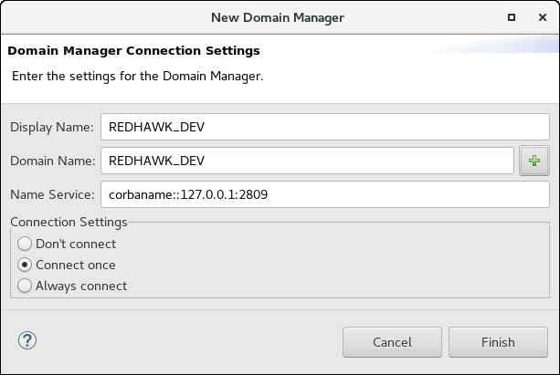

In the IDE, you can launch and connect to a domain through the IDE interface or connect to a running domain.

You can also [launch a domain and Device Manager from the command line]().

### Launching and Connecting Using the IDE

The following procedure explains how to launch and connect to a domain through the IDE.

1.  In the **REDHAWK Explorer View**, right-click **Target SDR** and select **Launch Domain…**

    ##### Launching a Domain
    

    The **Launch Domain Manager** window is displayed:

    ##### Launch Domain Manager
    

2.  In the **Domain Name** field, enter a name.

3.  Optionally, select a Device Manager to start.

    {}
A running Device Manager is required to launch applications.
    {}

4.  Optionally, in either the Domain Manager or Device Manager section, select a **Debug Level**. By default, the **Debug Level** is set to **Info**, which displays any messages at the **Info** level or higher: (**Info**, **Warn**, **Error**, and **Fatal** message levels). If this is the first time using REDHAWK, changing the **Debug Level** from **Info** to **Debug** for both the domain and Device Manager may be helpful in the learning process.

5.  Optionally, in either the Domain Manager or Device Manager section, select **Arguments** for the `nodeBooter` process. This option is provided to advanced users who are comfortable with [command line options]().

6.  Finally, click **OK** to launch and connect to the new domain.

7.  Notice that the IDE reacts to the newly launched domain:

    1.  The new domain has been added to the **REDHAWK Explorer View**

    2.  The new domain, within a short amount of time, is connected and this connection is indicated to the right of the domain name within the **REDHAWK Explorer View**.

    3.  At least one new **Console** view (within the" IDE) has been created. One contains a `nodeBooter` instance for the Domain Manager that launched and one `nodeBooter` instance for each Device Manager.

##### Console Showing the Domain Manager Start Up

### Connecting to a Running Domain

To connect to a running domain through the IDE use the following procedure:

1.  Click the **New Domain Connection** button (i.e. the plus symbol) in the upper right of the REDHAWK Explorer View.

    ##### New Domain Connection
    

    The **New Domain Manager** dialog is displayed:

    ##### New Domain Manager
    

2.  Enter the Name Service. This is the CORBA URI of the Naming Service where the domain is registered. By default, this is populated with the value from the IDE’s preferences (set by selecting **Window > Preferences**, **REDHAWK > Domain Connections**, **Default Naming Service**).

3.  To specify the domain to which you want to connect, chose one of the following options:

      - Enter a **Display Name** and a **Domain Name**. The Display Name is a used only in the IDE and does not need to match the Domain Name. The Domain Name is the actual name of the domain in the Naming Service.

      - Wait for the IDE to scan the name service for running domains. When the button next to **Display Name** shows a + icon, click it and select a running domain from the list.

4.  Click one of the following options under **Connection Settings**:

      - **Don’t connect**: This adds the domain to the **REDHAWK Explorer View** but leaves the domain in the disconnected state. When the IDE is restarted, the domain remains in the **REDHAWK Explorer** and is in the disconnected state. After adding a disconnected domain to the **REDHAWK Explorer View**, the domain may be connected by right-clicking the domain and selecting **Connect**.

      - **Connect Once**: This adds the domain to the **REDHAWK Explorer View** and connects the IDE with the domain. When the **REDHAWK IDE** is restarted, the domain remains in the **REDHAWK Explorer** but is in the disconnected state.

      - **Always Connect**: This adds the domain to the **REDHAWK Explorer View** and connects the IDE with the domain. When the **REDHAWK IDE** is restarted, the domain remains in the **REDHAWK Explorer** and attempts to connect with this domain.

5.  Select **Finish** to close the wizard.

6.  The domain now appears in the **REDHAWK Explorer View**. If **Connect Once** or **Always Connect** was chosen, the domain is connected. If **Don’t Connect** was selected, right-click the domain and select **Connect**.

    {}
Many of these options may be changed later through the Properties View.
    {}
