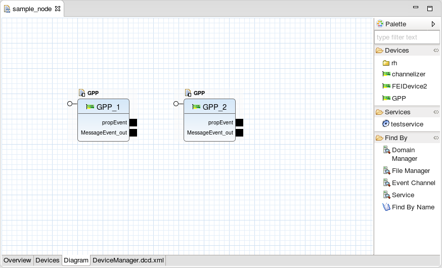
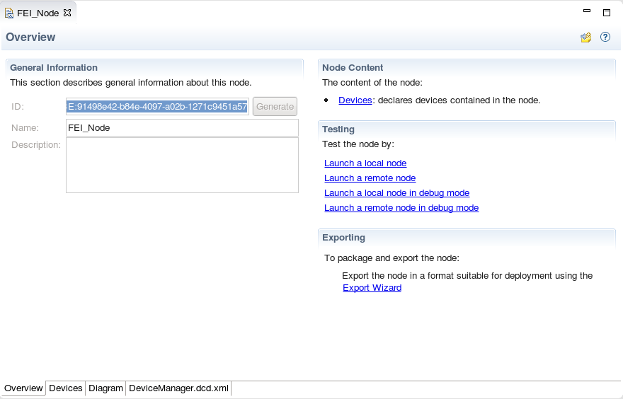
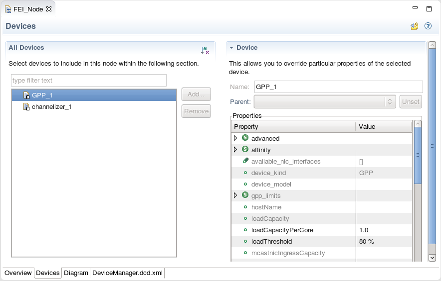

To open the Node Editor, double-click a DCD file from the Project Explorer View. It presents all the content that can be found within the `dcd.xml` file in an editing environment designed for ease of use. The **Node Editor** contains an **Overview**, **Devices**, **Diagram**, and a raw XML tab, which contains the DCD file content.

### Overview Tab
##### Node Editor Overview Tab

The **Overview** tab provides general information about the node, and hyperlinks to additional node-related sections within the IDE. From the **General Information** section, the **ID**, **Name**, and **Description** of the node may be set. The **Node Content** section provides a hyperlink to the **Devices** tab, which allows the user to specify what devices are within this node. The **Testing** section is currently under development and is presently not supported. Lastly, the **Exporting** section provides a hyperlink to the **Export Wizard**, which steps through the process of deploying the node into the SDR root.

### Devices Tab
##### Node Editor Devices Tab

The **Devices** tab enables a user to add devices from the SDR Root into the node and to configure the properties for the devices. When a property is set or changed here, it is specific to this node and does not impact other nodes or instances of this device.

The following steps explain how to add a device to the node:

1.  Click **Add…**.

2.  Select the device to add.

3.  Click **Finish**.

Use the table in the **Device** section to configure the nodes properties.

### Diagram Tab
##### Node Editor Diagram Tab

The **Diagram** section (along with the **properties View**) provides the same features as the **Devices** tab.

{}
To zoom in and out on the diagram, press and hold `Ctrl` then scroll up or down. Alternatively, press and hold `Ctrl` then press `+` or `-`.
{}

The following steps explain how to add a device to the node and configure its properties:

1.  Drag the device from the **Palette** onto the diagram.

2.  Click the device.

3.  Open the **Properties View**.

4.  From the **Properties View**, change the desired properties.

5.  Press `Ctrl+S` to save the changes.

{}
If you want to quickly find a device in the **Palette**, you can replace the text `type filter text` in the text field at the top of the **Palette** with a keyword to filter the device list.
{}

Like the **devices** tab, any property modified from the **Device** section is specific to this node and does not impact the device’s execution in other environments.

From the **Diagram** tab, a user may also use the [**Find By** feature](). The **Find By** feature enables a user to find a resource by name, a service by name or type, or an Event Channel by name.

Connections may be made from input to output ports by clicking and dragging from one port to the other. ports may have more than one connection drawn to or from them. Any unsupported or erroneous connection detected by the IDE is marked with an appropriate indicator. Hovering over the indicator provides information concerning the error.

The `dcd.xml` tab displays the raw XML data, which describes the node fully. Although not recommended, manually editing the XML file is supported.
