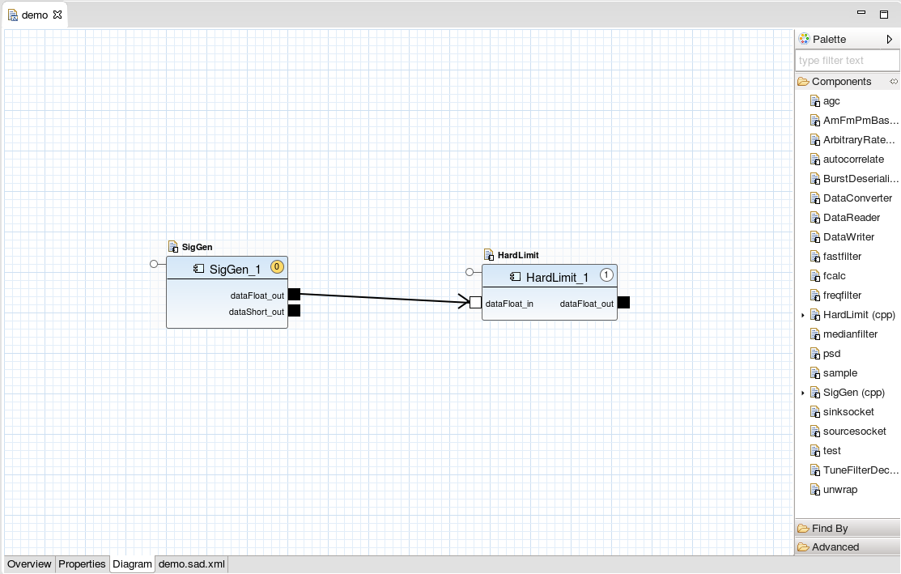

 To open the Waveform Editor, double-click a SAD file from the Project Explorer View. It presents all the content that can be found within the `sad.xml` file in an editing environment designed for ease of use. The Waveform Editor contains an **Overview**, **Properties**, **Diagram**, and a raw XML tab, which contains the SAD file content.

### Overview Tab

##### Waveform Editor Overview Tab

The **Overview** tab provides general information about the waveform, and hyperlinks to additional waveform-related sections within the IDE.

  - The **General Information** section provides controls to set the **ID**, **Name**, **Version**, **Controller** and **Description** for the waveform.

  - The **External Ports** section provides the ability to promote a component's port so it is accessible from the waveform object. By default, an [external port]() name is equal to the name of that port within the component, but the external port can be renamed.

    To change the external port name:

    1.  In the **External Ports** section, locate the port and click the cell in the **External Name** column in the port’s row.

    2.  Enter a new value for the name.
        ##### Renaming External Ports
        

    3.  Press **Enter**.

  - The **Testing** section allows for the launching of local waveforms. A local waveform does not require a running domain or Device Manager and executes within the Sandbox. A local waveform is similar to launching an individual component in the Chalkboard and constructs the waveform within a new Chalkboard instance. You may launch additional components into the waveform running in the Chalkboard using the palette. These newly launched components have standard runtime actions (Plot, Start, Stop, Terminate, and Connect) available. When the local running waveform is released these newly launched components are not saved in the waveform.

  - The **Exporting** section provides a hyperlink to the **Export Wizard**, which steps through the process of deploying the waveform into the SDR Root.

### Properties Tab
##### Waveform Editor Properties Tab

The **Properties** tab provides access to the component’s properties within the waveform. Within the **Properties** tab, you can:

  - Assign an external property ID
  - Set the overridden value within the SAD file
  - Filter and search for properties
  - Compare the overridden value to the original PRF value

The properties of the component designated as the Assembly Controller are always accessible externally and are grayed out in the **Properties** tab. Additional properties may be assigned an external ID, which allows for a particular component’s property to be designated as accessible to external waveform objects. See [External Properties]() for additional information.

To make a property external:

1.  Select the properties tab of the application’s SAD file.

2.  Edit the `External ID` field by entering the desired ID.

{}
 The external IDs must be unique. They can not duplicate another external property's ID, or the ID of a property belonging to the assembly controller.
{}

##### Waveform External Properties

### Diagram Tab
##### Waveform Editor Diagram Tab

You can use the **Diagram** tab to place components into a waveform, connect components together, set waveform-specific properties for components, make a [port external](), and add a FrontEnd Tuner device to a waveform.

{}
To zoom in and out on the diagram, press and hold `Ctrl` then scroll up or down. Alternatively, press and hold `Ctrl` then press `+` or `-`.
{}

To add a component to the waveform and configure its properties:

1.  Drag the component from the **Palette** onto the diagram.
2.  Right-click the component.
3.  Select **Show Properties**
4.  From the **Properties View**, change the desired properties.
5.  Press `Ctrl+S` to save the changes.

{}
If you want to quickly locate a component in the **Palette**, you can replace the text `type filter text` in the text field at the top of the **Palette** with a keyword to filter the component list.
{}

{}
Any property modified here is specific to this waveform and does not impact the component’s execution in other environments.
{}

To make a port external:

1.  Left-click the port you want to make external, to gain focus on the port.

2.  Right-click the port to open the port context menu.

3.  Select **Mark External Port**.
    ##### Mark External Ports
    

From the **Diagram** tab, a user may also use the [**Find By** feature](). The **Find By** feature enables a user to find a resource by name, a service by name or type, or an Event Channel by name.

Connections may be made from input to output ports by clicking and dragging from one port to the other. Multiple connections can be drawn to or from ports. Any unsupported or erroneous connection that the IDE can detect is marked with an appropriate indicator. Hovering over the indicator provides information concerning the error.

To add a dependency on a FrontEnd Tuner device that the waveform needs to use at runtime (a *usesdevice* in the XML):

1.  From the **Palette**, in the **Advanced** folder, select **Use FrontEnd Tuner Device** and drag it onto the diagram. The **Allocate Tuner** dialog is displayed.
    ##### Select Target Device
    

2.  Select the FrontEnd Tuner device you want to use. This will complete some of the information in the subsequent wizard pages. Alternatively, select **Generic FrontEnd Device** for defaults. Click **Next**.
    ##### Allocate Tuner
    

3.  Enter the **Uses Device ID** and optionally, enter the **Device Model**, and then click **Next**.

4.  Enter the appropriate information and click **Next**. See [**Allocate Tuner**]() for more details.
    ##### Identify Ports
    

5.  Enter the names of any uses and provides ports that you want to use from the target device and click **Finish**. The **Use FrontEnd Tuner Device** is displayed in the diagram. When you launch the waveform, the FrontEnd Tuner device must be available in order for the waveform to run.

    The `sad.xml` tab displays the raw XML data, which describes this waveform fully. Although not recommended, manually editing the XML file is supported.
