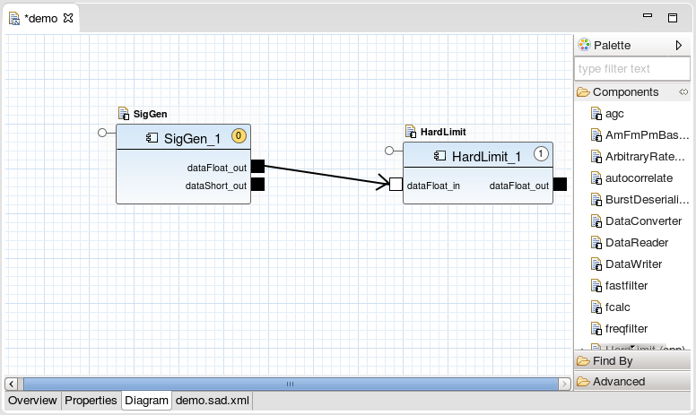

This section describes the process of creating a waveform, deploying this waveform to the staging area, starting a Domain Manager and a Device Manager, creating an instance of an application representing this waveform, releasing the application, and shutting down the Domain Manager and Device Manager.

The Domain Manager and Device Manager normally remain running during the creation/destruction of different applications.

### Create a Sample Waveform

Below is a description of how to create a waveform:

1.  Select **File > New > REDHAWK Waveform Project**

2.  Set the **Project name** to *demo*

3.  Select **Finish**

This opens an editor on the `demo.sad.xml` file.

To add components to this waveform:

1.  Select the **Diagram** tab.

2.  In the **Palette**, drag the `SigGen` component onto the diagram.

3.  In the **Palette**, drag the `HardLimit` component onto the diagram.

4.  Drag a connection between the `SigGen_1` **dataFloat_out** port and the `HardLimit_1` **dataFloat_in** port.

5.  The waveform looks like :
    ##### Demo Waveform
    

6.  If `SigGen_1` does not have a yellow 0, right-click the component and select **Set As Assembly Controller**/

7.  Press `Ctrl+S` to save or select **File > Save**.

8.  Close the waveform editor by selecting the **X** or by selecting **File > Close All**.

### Export the Waveform

Below is a description of how to export the waveform in the IDE:

1.  In the Project Explorer View (typically on the left-side) select *demo*.

2.  Drag the *demo* project onto the **Target SDR** in the REDHAWK Explorer View.

This installs the waveform into `$SDRROOT/dom/waveforms`. If a permissions denied error is encountered, ensure that the `$SDRROOT` is set up per the installation instructions in [Installing the Framework from Source]().

Verify that the waveform is installed:

1.  In the **REDHAWK Explorer View** expand **Target SDR**.

2.  Expand **Waveforms**.

3.  Verify that the *demo* waveform is shown.

### Run the Waveform on the Runtime Environment

This section provides an overview of how to launch a waveform as an application and release an application.

#### Launching a Domain

Begin by [starting a Domain Manager and Device Manager]()

#### Launch the Waveform

1.  In the REDHAWK Explorer View right-click the **REDHAWK_DEV** domain connection.

2.  Select **Launch Waveform...**

3.  Select the *demo* waveform, then select **Finish**.

4.  To start the waveform, select the **Start Waveform** (green triangle) button in the toolbar.

This opens the waveform explorer. A waveform is displayed in the **REDHAWK Explorer** by expanding the **REDHAWK_DEV** domain connection and the **waveforms** folder.

#### Open a Plot

1.  Left-click the **dataFloat_out** port to select it.

2.  Right-click the port to open the port context menu.

3.  Select **Plot Port Data**. This opens a plot showing the plot data.

4.  To clearly view the sinusoid wave in the plot, reduce the frequency produced by `SigGen`.

5.  Open the **Properties** View and change the frequency property to a value of *50*.

#### Stop and Release the Application

1.  Select the **Stop Waveform** (red square) button in the toolbar. The plot stops updating.

2.  Select the **Release Waveform** (red **X**) button in the toolbar. The waveform explorer closes.

#### Shutdown the Domain

Finally, [shutdown the Domain Manager and Device Manager]().
